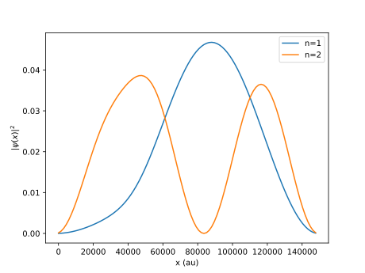
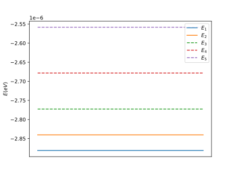

# CNT EDSR-Simulation
A simulation of EDSR in a carbon nanotube using kwant package.

Theory based on '_Coherent Single Electron Spin Control in a Slanting Zeeman Field_' by Tokura et. al.

* https://kwant-project.org
* https://tkwant.kwant-project.org

## My Development Environment
**docker images: joelpendleton/cnt-edsr-simulation**   

I recommend using my docker image by running the following
```
docker pull joelpendleton/cnt-edsr-simulation
docker start joelpendleton/cnt-edsr-simulation
```

Alternatively, you can following the run the following installation commands

### Linux and MacOS

```
conda create -n env-tkwant python=3.7
conda activate env-tkwant
conda install tkwant -c conda-forge
```

### Windows
```
conda create -n env-tkwant python=3.7
conda activate env-tkwant
conda install -c intel mpi4py
conda install tkwant -c conda-forge
```

## Example Plots

Plot of the probability density function over space:



Plot of the eigenenergies: 



