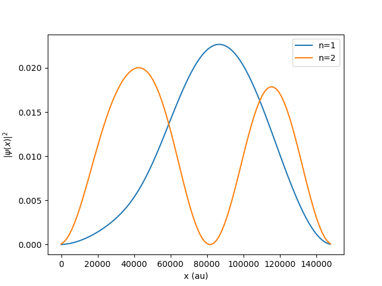

# CNT EDSR-Simulation
A simulation of EDSR in a carbon nanotube using tkwant package.

Theory based on '_Coherent Single Electron Spin Control in a Slanting Zeeman Field_' by Tokura et. al.

* https://kwant-project.org
* https://tkwant.kwant-project.org

